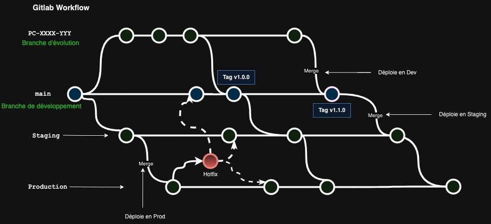

# Guide de contribution

## Gestion des branches

Les branches sont divisées en 4 catégories :

- Branches de suivi des environnements ( main, staging et production)

- Branches pour l'implémentation des nouvelles évolutions

- Branches pour la correction d'anomalies

- Branches pour corriger un bug critique en production (HotFix)

### Branches d'environnements

Chaque branche correspond à un environnement :

- `main`
  - Branche de développement, à partir de laquelle sont créées les branches d'évolutions
  - Reçoit le code des évolutions et correctifs
  - Fusion avec un Merge commit : `git merge --no-ff [ID]-[Description-courte]`
  - Le code fusioné dans main déclenche un workflow de déploiement sur l'environement de Dev
  - Porte tous les tags
- `staging`
  - Reçoit le code validé dans `main`
  - Fusion avec un Merge commit : `git merge --no-ff main`
  - Le code fusioné dans Staging déclenche un workflow de déploiement sur l'environement de Staging
- `production`
  - Reçoit le code validé dans `staging`
  - Fusion avec un Merge commit : `git merge --no-ff staging`
  - Le code fusionné dans Production déclenche un workflow de déploiement sur l'environement de Prod

#### Gitlab Flow

  

> Dans le cas d'un Hotfix le correctif doit être fusionné à la fois dans la branche d'environnement et dans main.

### Branches d'évolutions & de corrections

Chaque branche correspond à l'implémentation d'une évolution ou une correction

- Nomenclature : `[ID]-[Description courte]` où
    - `ID` corresspond au numéro de ticket de l'évolution dans `JIRA`
    - La `Description courte` ne doit pas dépasser les 5 mots
- Source : `main` : `git checkout -b [ID]-[Description courte] main`
- Chaque branche doit faire l'objet d'une PR

### Tags

Les tags matérialisent le code source livré en production, ils sont créés quand le code est mergé et déployé en production

Les tags sont créés avec annotation avec la commande : `git tag v[Version] -a`

La version est de la forme [Majeure].[Intermédiaire].[Mineure] :

[Majeure] : version incrémentée lors d'une évolution importante de l'API 
[Intermédiaire] : version incrémentée lors d'une évolution intermédiaire
[Mineure] : version incrémentée lors d'une évolution mineure

### Déploiement manuellement sur l'environement de dev 

Pour tester sa branche sur l'environement de DEV avant de merger sur Main il est possible de lancer un déploiement manuel :

1) Aller dans  l'onglet [Action](https://github.com/pass-culture/api-data/actions) sur le repo
2) Selectioner le worfkflow en question ( deeploy API Compliance / Deploy API Reco )
3) Dans Menu `Run Workflow` vous selectioner votre branche et cliquer sur `run workflow`

### Réferences

https://github.com/jadsonjs/gitlab-flow

https://about.gitlab.com/topics/version-control/what-is-gitlab-flow/

https://about.gitlab.com/topics/version-control/what-are-gitlab-flow-best-practices/
