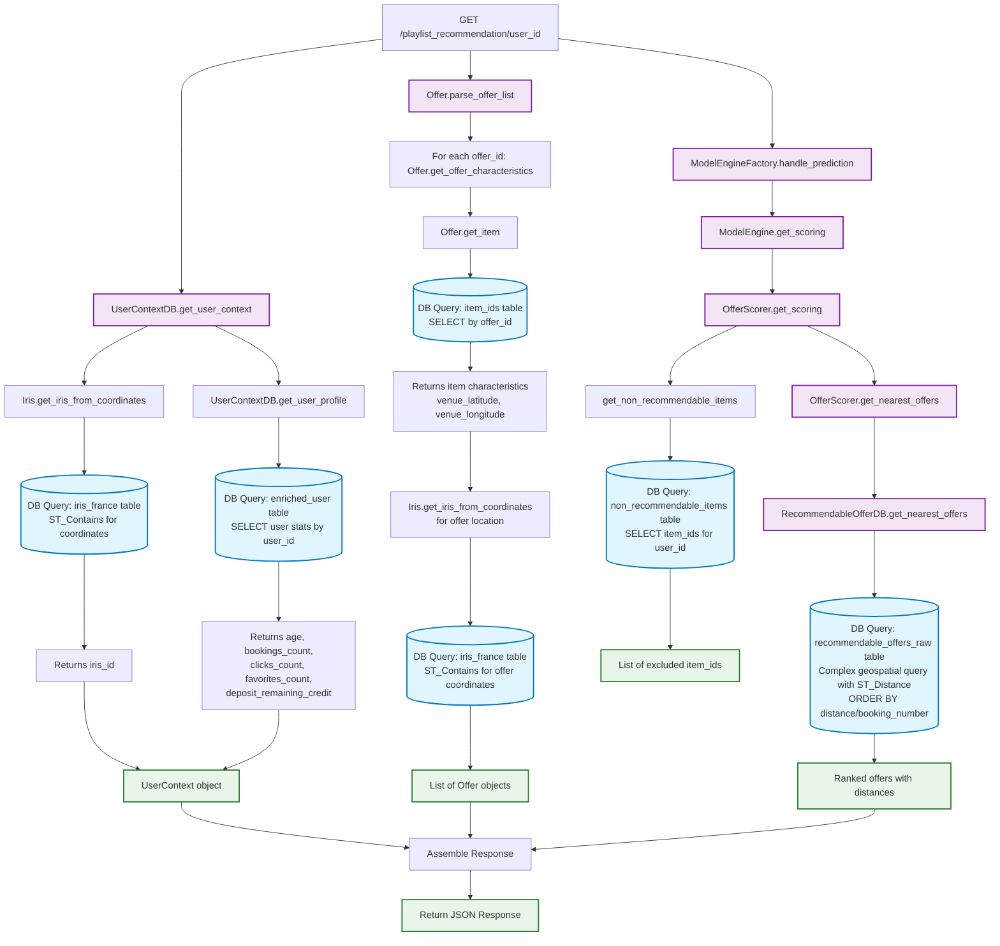

# Database Flow Diagram for `/playlist_recommendation/{user_id}` Route

## Overview
This diagram explains all database interactions when calling the `/playlist_recommendation/{user_id}` route in the recommendation API.



## Database Tables Accessed

### 1. **iris_france** table
- **Purpose**: Convert geographic coordinates (latitude/longitude) to IRIS administrative codes
- **Queries**:
  - For user location: `ST_Contains(shape, POINT(longitude, latitude))`
  - For each input offer location: Same spatial query
- **Used by**: `Iris.get_iris_from_coordinates()`

### 2. **enriched_user** table
- **Purpose**: Get user profile information and behavior statistics
- **Query**:
  ```sql
  SELECT user_id,
         date_part('year', age(user_birth_date)) as age,
         coalesce(booking_cnt, 0) as bookings_count,
         coalesce(consult_offer, 0) as clicks_count,
         coalesce(has_added_offer_to_favorites, 0) as favorites_count,
         coalesce(user_theoretical_remaining_credit, user_deposit_initial_amount) as user_deposit_remaining_credit
  WHERE user_id = ?
  ```
- **Used by**: `UserContextDB.get_user_profile()`

### 3. **item_ids** table
- **Purpose**: Get offer characteristics including venue coordinates
- **Query**: `SELECT * WHERE offer_id = ?` (for each input offer)
- **Returns**: item_id, venue_latitude, venue_longitude, booking_number, is_sensitive
- **Used by**: `Offer.get_item()`

### 4. **non_recommendable_items** table
- **Purpose**: Filter out items that shouldn't be recommended to the user
- **Query**: `SELECT item_id WHERE user_id = ?`
- **Used by**: `get_non_recommendable_items()`

### 5. **recommendable_offers_raw** table
- **Purpose**: Find the nearest available offers for recommendation
- **Query**: Complex geospatial query using:
  - `ST_Distance()` for distance calculation
  - Window functions with `ROW_NUMBER()` for ranking
  - Filtering by item_ids from ML model predictions
  - Ordering by distance or booking popularity
- **Used by**: `RecommendableOfferDB.get_nearest_offers()`

## Key Database Interaction Points

1. **User Context Building** (2 queries)
   - Geographic location → IRIS code
   - User profile data retrieval

2. **Input Offer Processing** (2×N queries, where N = number of input offers)
   - Offer characteristics lookup
   - Geographic location → IRIS code for each offer

3. **Recommendation Filtering** (1 query)
   - Exclude non-recommendable items for the user

4. **Final Offer Selection** (1 complex query)
   - Geospatial distance calculation and ranking
   - Combines ML predictions with geographic and popularity data

## Performance Considerations

- **Caching**: The system uses caching for `recommendable_offers` to avoid repeated complex queries
- **Geospatial Queries**: Heavy use of PostGIS spatial functions (`ST_Contains`, `ST_Distance`)
- **Query Complexity**: The final recommendation query is the most complex, involving window functions and spatial calculations
- **Query Count**: Total queries ≈ 5 + (2 × number_of_input_offers)

## Summary

The route performs approximately **5-10 database queries** depending on the number of input offers:
- **2 queries** for user context (location + profile)
- **2×N queries** for input offer processing (N = number of input offers)
- **1 query** for filtering non-recommendable items
- **1 complex query** for finding and ranking nearest recommendable offers

The most database-intensive part is the final recommendation scoring, which involves complex geospatial calculations to find the nearest relevant offers based on ML model predictions.
