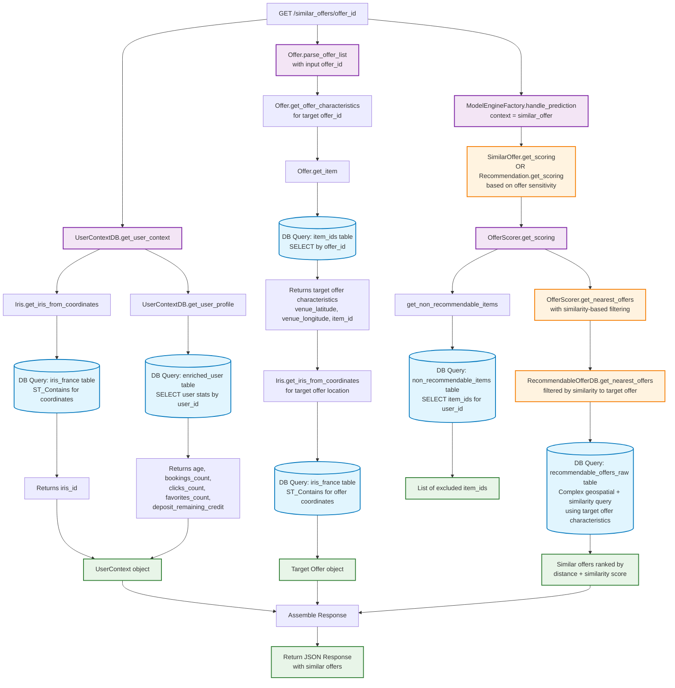

# Database Flow Diagram for `/similar_offers/{offer_id}` Route

## Overview

This diagram explains all database interactions when calling the `/similar_offers/{offer_id}` route in the recommendation API. This route finds offers similar to a specific input offer.



## Database Tables Accessed

### 1. **iris_france** table

- **Purpose**: Convert geographic coordinates (latitude/longitude) to IRIS administrative codes
- **Queries**:
  - For user location: `ST_Contains(shape, POINT(longitude, latitude))`
  - For target offer location: Same spatial query
- **Used by**: `Iris.get_iris_from_coordinates()`

### 2. **enriched_user** table

- **Purpose**: Get user profile information and behavior statistics
- **Query**:

  ```sql
  SELECT user_id,
         date_part('year', age(user_birth_date)) as age,
         coalesce(booking_cnt, 0) as bookings_count,
         coalesce(consult_offer, 0) as clicks_count,
         coalesce(has_added_offer_to_favorites, 0) as favorites_count,
         coalesce(user_theoretical_remaining_credit, user_deposit_initial_amount) as user_deposit_remaining_credit
  WHERE user_id = ?
  ```

- **Used by**: `UserContextDB.get_user_profile()`

### 3. **item_ids** table

- **Purpose**: Get target offer characteristics for similarity comparison
- **Query**: `SELECT * WHERE offer_id = ?` (for the target offer)
- **Returns**: item_id, venue_latitude, venue_longitude, booking_number, is_sensitive
- **Used by**: `Offer.get_item()`

### 4. **non_recommendable_items** table

- **Purpose**: Filter out items that shouldn't be recommended to the user
- **Query**: `SELECT item_id WHERE user_id = ?`
- **Used by**: `get_non_recommendable_items()`

### 5. **recommendable_offers_raw** table

- **Purpose**: Find offers similar to the target offer
- **Query**: Complex similarity-based query using:
  - Target offer characteristics for similarity filtering
  - `ST_Distance()` for geographic proximity
  - Window functions with `ROW_NUMBER()` for ranking
  - Filtering by categories/subcategories if specified
  - Ordering by similarity score and distance
- **Used by**: `RecommendableOfferDB.get_nearest_offers()`

## Key Differences from `/playlist_recommendation`

### 1. **Model Selection Logic**

- **Similar Offers**: Uses `SimilarOffer` model engine by default
- **Fallback**: Falls back to `Recommendation` model if target offer is sensitive or no input offers
- **Context**: Uses `"similar_offer"` context instead of `"recommendation"`

### 2. **Target Offer Processing**

- **Single Offer Focus**: Processes only ONE target offer (the `offer_id` in the URL)
- **Similarity Baseline**: Target offer characteristics become the baseline for similarity scoring
- **Category Filtering**: Can filter by categories/subcategories related to the target offer

### 3. **Retrieval Strategy**

- **Similarity-based**: ML model focuses on finding items similar to the target offer
- **Geographic + Content**: Combines geographic proximity with content-based similarity
- **Playlist Type**: Uses `GetSimilarOfferPlaylistParams` with specialized playlist types:
  - `sameCategorySimilarOffers`
  - `sameSubCategorySimilarOffers`
  - `otherCategoriesSimilarOffers`
  - `GenericSimilarOffers`

## Database Query Pattern

The route performs approximately **5-6 database queries**:

1. **User Context Queries (2 queries)**:
   - Geographic location → IRIS code
   - User profile data retrieval

2. **Target Offer Processing (2 queries)**:
   - Target offer characteristics lookup
   - Geographic location → IRIS code for target offer

3. **Recommendation Filtering (1 query)**:
   - Exclude non-recommendable items for the user

4. **Similar Offers Selection (1 complex query)**:
   - Similarity-based geospatial query using target offer as baseline
   - Ranking by similarity score and geographic proximity

## Performance Considerations

- **Similarity Computation**: Uses ML model endpoints to compute content-based similarity
- **Geographic Filtering**: Still uses PostGIS spatial functions for location-based filtering
- **Caching**: Uses the same caching mechanism as playlist recommendations
- **Target Offer Dependency**: Performance depends on the characteristics of the target offer
- **Query Complexity**: Similar complexity to playlist recommendations but with different ranking criteria

## Summary

The `/similar_offers/{offer_id}` route has a **similar database access pattern** to `/playlist_recommendation` but with key differences:

- **Purpose**: Find offers similar to a specific target offer vs. general user recommendations
- **Query Count**: ~5-6 queries (slightly fewer since only one input offer)
- **Model Logic**: Uses similarity-based ML models with target offer as reference point
- **Ranking**: Prioritizes content similarity over pure geographic proximity
- **Fallback**: Can fall back to general recommendations if target offer is problematic

The most database-intensive part remains the final similarity search, which combines ML-based similarity scoring with geospatial calculations to find the best matching offers.
