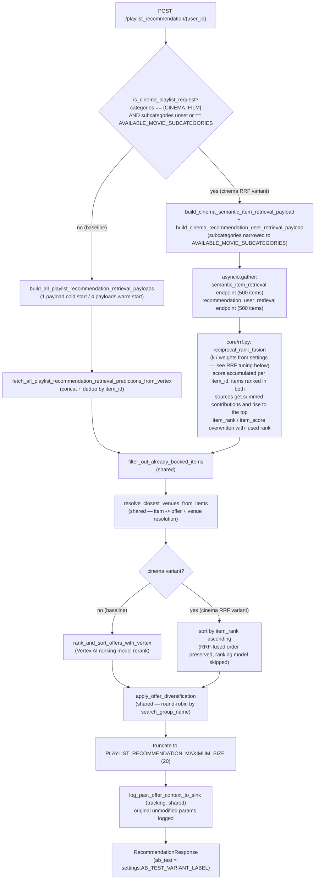

# AB Test: Cinema RRF Retrieval (`ab-test-algo-cine-rrf`)

This document describes the pipeline flow for the cinema-specific retrieval variant tested on
the `playlist_recommendation` endpoint. For the general A/B testing conventions (branch naming,
`HACK for AB testing` blocks, cache isolation, BigQuery traceability), see
[`docs/ab_testing.md`](./ab_testing.md).

## Business context

For playlist requests scoped to cinema (`categories == [CINEMA, FILM]`, with `subcategories`
either unset or exactly the movie-screening subcategories — see
[Trigger condition](#trigger-condition)), this test replaces the standard ISO v1 retrieval
strategy (4 payloads against a single Vertex endpoint) with a fusion of two independent retrieval
sources — a content-based (semantic) model and the standard collaborative-filtering model —
combined with Reciprocal Rank Fusion (RRF). The RRF-fused order becomes the final playlist
ranking directly, bypassing the downstream Vertex ranking model.

## Trigger condition

```python
def is_cinema_playlist_request(params: PlaylistRequestParams) -> bool:
    if params.categories is None or set(params.categories) != set(MOVIE_LIKE_CATEGORIES):
        return False
    return params.subcategories is None or set(params.subcategories) == set(AVAILABLE_MOVIE_SUBCATEGORIES)
```

(`src/core/retrieval.py`.) Both conditions must hold:

- `categories` is *exactly* `{CINEMA, FILM}` (`MOVIE_LIKE_CATEGORIES`) — not a superset or subset.
- `subcategories` is either unset, or *exactly* the movie-screening subcategories
  (`AVAILABLE_MOVIE_SUBCATEGORIES` = `{CINE_VENTE_DISTANCE, EVENEMENT_CINE, FESTIVAL_CINE, SEANCE_CINE}`).

The subcategories check exists so a request that sets `categories=[CINEMA, FILM]` but asks for an
unrelated (or partial) subcategory filter does **not** trigger the variant — silently overriding
the client's own subcategory filter would be surprising and isn't what this test measures.

## Pipeline flow



## Step-by-step

| # | Stage | Baseline | Cinema RRF variant |
| --- | --- | --- | --- |
| 1 | Context building | User context, geolocation, IRIS resolution | Same (shared) |
| 2 | Retrieval | 4 payloads → 1 Vertex endpoint (`recommendation_user_retrieval`), merged by dedup | 2 payloads → 2 Vertex endpoints (`semantic_item_retrieval` + `recommendation_user_retrieval`), 500 items each, merged by RRF |
| 3 | Booked-item filter | `filter_out_already_booked_items` | Same (shared) |
| 4 | Offer resolution | `resolve_closest_venues_from_items` | Same (shared); offer-resolution cache **not** isolated per variant (only the candidate set differs, not resolution logic) |
| 5 | Ranking | Vertex AI ranking model rerank (`rank_and_sort_offers_with_vertex`) | **Skipped.** Offers sorted by `item_rank` (the RRF-fused rank set in step 2) |
| 6 | Diversification | `apply_offer_diversification` (round-robin by `search_group_name`) | Same (shared) — effectively a no-op here since cinema requests are single-category |
| 7 | Truncation | Top `PLAYLIST_RECOMMENDATION_MAXIMUM_SIZE` (20) | Same (shared) |
| 8 | Tracking | `log_past_offer_context_to_sink` with the client's original `params` | Same (shared) — the cinema retrieval's internal subcategory narrowing does not mutate `params`, so tracking reflects what the client actually requested |

## Key files

| File | Role |
| --- | --- |
| `src/controllers/pipeline_playlist_recommendation.py` | Orchestrator; both `HACK for AB testing` blocks (retrieval dispatch, ranking dispatch) live here |
| `src/core/retrieval.py` | `MOVIE_LIKE_CATEGORIES`, `AVAILABLE_MOVIE_SUBCATEGORIES`, `is_cinema_playlist_request`, cinema payload builders, `fetch_cinema_rrf_retrieval_predictions_from_vertex` |
| `src/core/rrf.py` | Generic `reciprocal_rank_fusion` algorithm (no Vertex/domain dependency beyond `RecommendableItem`) |
| `src/connectors/__init__.py`, `src/config/settings.py` | `semantic_item_retrieval_api_client`, `VERTEX_SEMANTIC_ITEM_RETRIEVAL_ENDPOINT_NAME` |
| `src/connectors/vertex_api.py`, `src/schemas/vertex_prediction_item.py` | `ItemOrigin.SEMANTIC` provenance disambiguation, mirroring the existing `GRAPH` pattern |

## Constants

| Constant | Value | Location |
| --- | --- | --- |
| `CINEMA_RRF_RETRIEVAL_SIZE_PER_ENDPOINT` | 500 | `src/core/retrieval.py` |
| `PLAYLIST_RECOMMENDATION_MAXIMUM_SIZE` | 20 | `src/controllers/pipeline_playlist_recommendation.py` (shared, unchanged) |

### RRF tuning (env-configurable per Cloud Run revision)

`core/rrf.py`'s `reciprocal_rank_fusion` itself only defines generic algorithm defaults
(`DEFAULT_K = 60`, `DEFAULT_WEIGHT = 1.0`), used when a caller doesn't override them. The cinema
AB test always passes explicit values sourced from `settings` (`src/config/settings.py`), so `k`
and the per-source weights can be tuned per revision without a redeploy:

| Setting | Env var | Default |
| --- | --- | --- |
| RRF smoothing constant | `CINEMA_RRF_K` | `60` |
| Semantic source weight | `CINEMA_RRF_SEMANTIC_WEIGHT` | `1.5` |
| Recommendation source weight | `CINEMA_RRF_RECOMMENDATION_WEIGHT` | `1.0` |

## Known caveat

With the ranking-model rerank skipped for cinema, `item_score` on the final offers is the raw RRF
fused score rather than a ranking-model probability. Any downstream consumer that compares
`item_score` across playlists/models should be aware this value is not on the same scale for
cinema playlists as for the baseline.
