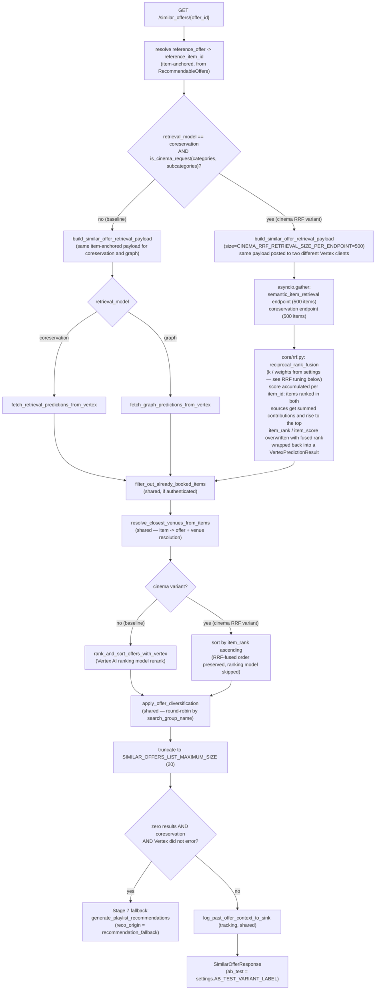

# AB Test: Cinema RRF Retrieval (`ab-test-algo-cine-rrf`)

This document describes the pipeline flow for the cinema-specific retrieval variant tested on
the `similar_offer` endpoint. For the general A/B testing conventions (branch naming,
`HACK for AB testing` blocks, cache isolation, BigQuery traceability), see
[`docs/ab_testing.md`](./ab_testing.md).

> This test was originally implemented on `playlist_recommendation` and moved here:
> `playlist_recommendation`'s retrieval is a 4-payload merge (not a single item-anchored call) and
> never issues a user-personalized request from `similar_offer`'s context, so it didn't fit the
> test well. `similar_offer` is anchored on a reference item, which pairs naturally with a
> content-based (semantic) retrieval signal.

## Business context

For `GET /similar_offers/{offer_id}` requests using the `coreservation` retrieval model, scoped to
cinema (`categories == [CINEMA, FILM]`, with `subcategories` either unset or exactly the
movie-screening subcategories — see [Trigger condition](#trigger-condition)), this test replaces
the standard single-endpoint retrieval with a fusion of two independent retrieval sources — a
content-based (semantic) model and the existing coreservation model — combined with Reciprocal
Rank Fusion (RRF). The RRF-fused order becomes the final similar-offers ranking directly,
bypassing the downstream Vertex ranking model. The `graph` retrieval model is untouched.

## Trigger condition

```python
def is_cinema_request(
    categories: list[CategoryEnum] | None,
    subcategories: list[SubcategoryEnum] | None,
) -> bool:
    if categories is None or set(categories) != set(MOVIE_LIKE_CATEGORIES):
        return False
    return subcategories is None or set(subcategories) == set(AVAILABLE_MOVIE_SUBCATEGORIES)
```

(`src/core/retrieval.py`.) The variant fires only when **both** of these hold:

- `retrieval_model == SimilarOfferModelChoices.coreservation` (checked in the controller, not in
  `is_cinema_request` itself — `graph` is never intercepted).
- `is_cinema_request(categories, subcategories)` is `True`: `categories` is *exactly*
  `{CINEMA, FILM}` (`MOVIE_LIKE_CATEGORIES`) — not a superset or subset — and `subcategories` is
  either unset, or *exactly* the movie-screening subcategories (`AVAILABLE_MOVIE_SUBCATEGORIES` =
  `{CINE_VENTE_DISTANCE, EVENEMENT_CINE, FESTIVAL_CINE, SEANCE_CINE}`).

The subcategories check exists so a request that sets `categories=[CINEMA, FILM]` but asks for an
unrelated (or partial) subcategory filter does **not** trigger the variant — silently overriding
the client's own subcategory filter would be surprising and isn't what this test measures. Nesting
under `coreservation` keeps the existing Stage 7 zero-results fallback to
`generate_playlist_recommendations` active unchanged, since that fallback already only fires for
`retrieval_model == coreservation`.

## Pipeline flow



## Step-by-step

| # | Stage | Baseline | Cinema RRF variant |
| --- | --- | --- | --- |
| 1 | Context building | Resolve `reference_offer`/`reference_item_id`, user context, geolocation (GPS → subscription centroid → offer venue) | Same (shared) |
| 2 | Retrieval | 1 payload → 1 Vertex endpoint (`coreservation` or `graph`, chosen by `retrieval_model`) | 1 payload (size 500) → 2 Vertex endpoints (`semantic_item_retrieval` + `coreservation`), merged by RRF. Only reachable when `retrieval_model == coreservation` |
| 3 | Booked-item filter | `filter_out_already_booked_items` (if authenticated) | Same (shared) |
| 4 | Offer resolution | `resolve_closest_venues_from_items` | Same (shared); offer-resolution cache **not** isolated per variant (only the candidate set differs, not resolution logic) |
| 5 | Ranking | Vertex AI ranking model rerank (`rank_and_sort_offers_with_vertex`) | **Skipped.** Offers sorted by `item_rank` (the RRF-fused rank set in step 2) |
| 6 | Diversification | `apply_offer_diversification` (round-robin by `search_group_name`) | Same (shared) — effectively a no-op here since cinema requests are single-category |
| 7 | Truncation | Top `SIMILAR_OFFERS_LIST_MAXIMUM_SIZE` (20) | Same (shared) |
| 8 | Fallback (coreservation only) | Zero results + Vertex did not error → delegates entirely to `generate_playlist_recommendations` | Same (shared) — still fires for cinema, since the variant is nested under `coreservation` |
| 9 | Tracking | `log_past_offer_context_to_sink` (unconditional, regardless of auth) | Same (shared) |

## Key files

| File | Role |
| --- | --- |
| `src/controllers/pipeline_similar_offer.py` | Orchestrator; both `HACK for AB testing` blocks (retrieval dispatch, ranking dispatch) live here |
| `src/core/retrieval.py` | `MOVIE_LIKE_CATEGORIES`, `AVAILABLE_MOVIE_SUBCATEGORIES`, `is_cinema_request`, `build_similar_offer_retrieval_payload` (reused as-is for both cinema calls, via its optional `size` param), `fetch_similar_offer_cinema_rrf_retrieval_predictions_from_vertex` |
| `src/core/rrf.py` | Generic `reciprocal_rank_fusion` algorithm (no Vertex/domain dependency beyond `RecommendableItem`) |
| `src/connectors/__init__.py`, `src/config/settings.py` | `semantic_item_retrieval_api_client`, `VERTEX_SEMANTIC_ITEM_RETRIEVAL_ENDPOINT_NAME` |
| `src/connectors/vertex_api.py`, `src/schemas/vertex_prediction_item.py` | `ItemOrigin.SEMANTIC` provenance disambiguation, mirroring the existing `GRAPH` pattern |

## Constants

| Constant | Value | Location |
| --- | --- | --- |
| `CINEMA_RRF_RETRIEVAL_SIZE_PER_ENDPOINT` | 500 | `src/core/retrieval.py` |
| `SIMILAR_OFFERS_LIST_MAXIMUM_SIZE` | 20 | `src/controllers/pipeline_similar_offer.py` (shared, unchanged) |

### RRF tuning (env-configurable per Cloud Run revision)

`core/rrf.py`'s `reciprocal_rank_fusion` itself only defines generic algorithm defaults
(`DEFAULT_K = 60`, `DEFAULT_WEIGHT = 1.0`), used when a caller doesn't override them. The cinema
AB test always passes explicit values sourced from `settings` (`src/config/settings.py`), so `k`
and the per-source weights can be tuned per revision without a redeploy:

| Setting | Env var | Default |
| --- | --- | --- |
| RRF smoothing constant | `CINEMA_RRF_K` | `60` |
| Semantic source weight | `CINEMA_RRF_SEMANTIC_WEIGHT` | `1.5` |
| Recommendation source weight | `CINEMA_RRF_RECOMMENDATION_WEIGHT` | `1.0` |

## Known caveats

- With the ranking-model rerank skipped for cinema, `item_score` on the final offers is the raw
  RRF fused score rather than a ranking-model probability. Any downstream consumer that compares
  `item_score` across playlists/models should be aware this value is not on the same scale for
  cinema similar-offer results as for the baseline.
- `fetch_similar_offer_cinema_rrf_retrieval_predictions_from_vertex` reports `status="error"` only
  when **both** the semantic and coreservation calls fail. If exactly one source fails, the fused
  pool still contains real candidates from the surviving source and is treated as `"success"` — so
  the Stage 7 fallback-vs-honest-empty-response distinction stays meaningful (a single source
  outage does not by itself trigger the playlist fallback).
