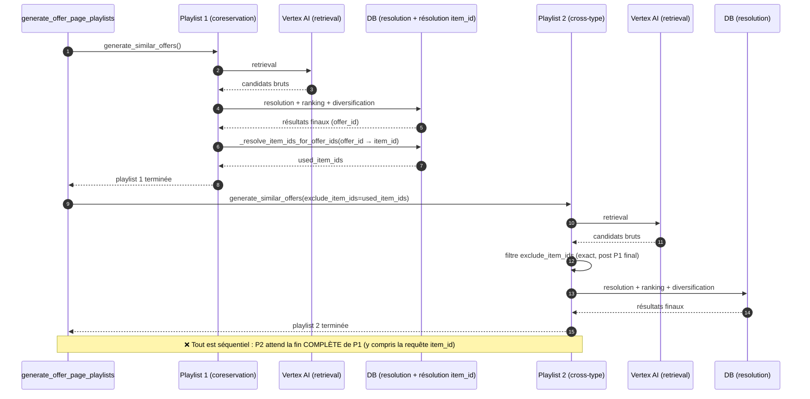
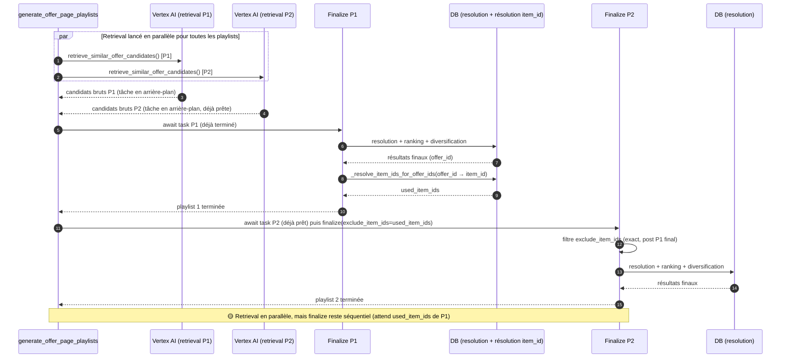
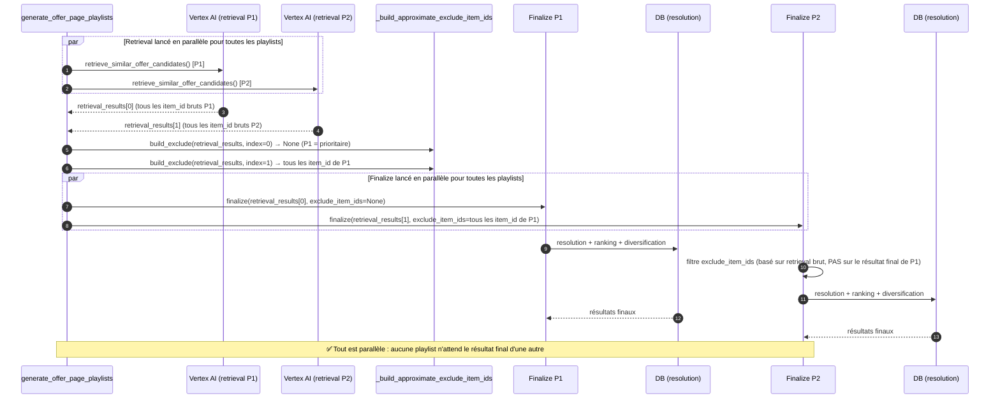

# Déduplication cross-playlist dans `offer_page_playlists`

L'endpoint `/offer_page_playlists/{offer_id}` génère plusieurs playlists de similar offers
(cf. [`offer_page_playlists.md`](./offer_page_playlists.md)). Sans précaution particulière,
une même offre (ou plutôt un même `item_id`, une offre pouvant exister en plusieurs
"duplicatas" — différentes dates/stocks/venues) peut apparaître dans deux playlists
différentes de la même page (ex: "Les fans aiment aussi" ET "Ça peut aussi te plaire").

Trois implémentations successives ont résolu ce problème, avec des compromis différents
entre **exactitude de la déduplication** et **performance (latence)**. Ce document compare
les trois approches, telles qu'introduites par les commits suivants sur la branche
`jmontagnat/deduplicate-cross-playlist-similar-offer-rebase` :

| # | Commit | Titre |
| - | ------ | ----- |
| 1 | `431e7ee` | `feat(reco_v2): deduplicate cross-playlist recommendations by item id in offer page pipeline` |
| 2 | `919c7a2` | `perf(reco_v2): parallelize candidate retrieval across playlists in offer page pipeline` |
| 3 | `13b3b40` | `feat(reco_v2): parallelize playlist finalization with approximate cross-playlist deduplication` |

Dans les trois versions, le principe de base reste le même : chaque playlist a une
priorité (l'ordre défini par `build_similar_offer_playlist_configs`, "Les fans aiment
aussi" étant toujours prioritaire), et les `item_id` déjà "utilisés" par une playlist de
priorité supérieure sont retirés du pool de candidats d'une playlist de priorité
inférieure, **avant** ranking/diversification/troncature.

Rappel des étapes du pipeline `generate_similar_offers` (pour une seule playlist) :

1. Construction du contexte
2. **Retrieval** (appel Vertex AI) — réseau, coûteux
3. Filtrage des offres déjà réservées
4. Résolution des venues les plus proches (DB)
5. Ranking (Vertex AI)
6. Diversification / troncature
7. Fallback (si 0 résultat)
8. Logging

---

## Approche 1 — Séquentielle, déduplication exacte sur les résultats finaux (`431e7ee`)

### Fonctionnement

Les playlists sont générées **une par une, entièrement**, dans l'ordre de priorité :

```
for playlist_config in configs:
    result = await generate_similar_offers(..., exclude_item_ids=used_item_ids)
    used_item_ids |= await _resolve_item_ids_for_offer_ids(result.results)  # requête DB supplémentaire
```

- Chaque playlist exécute tout son pipeline (retrieval Vertex AI → resolution → ranking →
  diversification → troncature) avant que la suivante ne démarre.
- Une fois la playlist terminée, ses `offer_id` finaux sont retraduits en `item_id` via
  une requête SQL dédiée (`_resolve_item_ids_for_offer_ids`, table
  `recommendable_offers_raw_mv`), car les résultats finaux sont des `offer_id` (offres
  concrètes, potentiellement dupliquées par venue/stock) alors que la déduplication doit se
  faire au niveau `item_id` (l'entité "produit" abstraite).
- L'ensemble `used_item_ids` s'enrichit à chaque itération et est passé à la playlist
  suivante, qui filtre son pool de candidats **avant** ranking/diversification.



### Exactitude du résultat

✅ **Déduplication exacte** : l'exclusion est basée sur les résultats *réellement affichés*
de chaque playlist précédente (après resolution + ranking + diversification + troncature).
Il ne peut donc jamais y avoir de doublon d'`item_id` entre deux playlists de la page.

### Performance

❌ **La plus lente des trois** : latence quasi **additive**.
- Playlist 2 ne peut démarrer son appel Vertex AI (l'étape la plus coûteuse en réseau)
  qu'une fois playlist 1 **entièrement terminée**, y compris la requête DB supplémentaire
  de résolution `offer_id → item_id`.
- Latence totale ≈ somme des latences de chaque playlist + N requêtes DB de résolution
  supplémentaires (une par playlist, sauf la première).
- Avec 2 playlists (cas standard) cela double quasiment le temps de réponse ; avec 2
  playlists pour LIVRES/MUSIQUE, idem.

---

## Approche 2 — Retrieval parallélisé, finalisation séquentielle, déduplication toujours exacte (`919c7a2`)

### Fonctionnement

Le pipeline `generate_similar_offers` est scindé en deux phases réutilisables :
- `retrieve_similar_offer_candidates` (étapes 1-3 : contexte + appel Vertex AI + filtre déjà-réservé)
- `finalize_similar_offers` (étapes 3bis-8 : dédup + resolution + ranking + diversification + fallback + logging)

```
retrieval_tasks = [create_task(retrieve(...)) for config in configs]   # lancés tous en parallèle, tout de suite

for config, task in zip(configs, retrieval_tasks):
    retrieval = await task                       # déjà (quasi) terminé, attente courte
    item = await finalize(retrieval, exclude_item_ids=used_item_ids)   # séquentiel
    used_item_ids |= resolve(item.results)        # requête DB supplémentaire, comme avant
```

- La phase **retrieval** (l'appel réseau à Vertex AI, la plus coûteuse) de **toutes** les
  playlists est lancée dès le départ, en concurrence (elle ne dépend d'aucune autre
  playlist).
- La phase **finalize** reste séquentielle et strictement dans l'ordre de priorité, car
  elle a toujours besoin des résultats finaux (post-diversification) de la playlist
  précédente pour construire `exclude_item_ids` — la logique de déduplication elle-même
  n'a pas changé par rapport à l'approche 1.



### Exactitude du résultat

✅ **Déduplication exacte**, identique à l'approche 1 (même mécanisme de résolution
`offer_id → item_id` sur les résultats finaux). Aucun changement fonctionnel de ce point
de vue.

### Performance

🟡 **Intermédiaire** : gain significatif par rapport à l'approche 1, mais pas optimal.
- Les appels Vertex AI de toutes les playlists se chevauchent : le retrieval de la
  playlist 2 ne "coûte" quasiment plus rien en latence supplémentaire une fois son tour
  venu (déjà en cours/terminé pendant que playlist 1 finalise).
- Il reste néanmoins **séquentiel** : resolution DB + ranking + diversification +
  requête de résolution `item_id` de chaque playlist, en série. Ces étapes restent
  cumulatives.
- Gain estimé : proche de "temps du plus long retrieval + somme des temps de
  finalisation", au lieu de "somme complète (retrieval + finalisation) de chaque
  playlist".

---

## Approche 3 — Tout parallèle, déduplication sur le pool de retrieval complet (`13b3b40`, état HEAD actuel)

### Fonctionnement

```
retrieval_results = await gather(*[retrieve(...) for config in configs])   # tout en parallèle

finalize_tasks = [
    create_task(finalize(retrieval_results[i], exclude_item_ids=build_exclude(retrieval_results, i)))
    for i, config in enumerate(configs)
]
playlist_items = await gather(*finalize_tasks)   # tout en parallèle aussi
```

- Retrieval **et** finalisation de **toutes** les playlists sont désormais lancés en
  parallèle via `asyncio.gather`.
- Comme aucune playlist n'attend plus les résultats *finaux* d'une autre, l'ensemble
  d'exclusion est construit par `_build_approximate_exclude_item_ids` à partir de
  **l'intégralité** du pool de candidats de retrieval (`unbooked_candidate_items`,
  déjà filtré des offres réservées) de chaque playlist de priorité supérieure — pas
  seulement de son top-N. Concrètement : pour toute playlist de priorité inférieure,
  on exclut l'union de **tous** les `item_id` retournés par le retrieval Vertex AI de
  chaque playlist plus prioritaire.
- Plus besoin de requête DB de résolution `offer_id → item_id` : les candidats de
  retrieval exposent déjà `item_id` directement (pas de aller-retour SQL supplémentaire).



### Exactitude du résultat

✅ **Aucun doublon possible entre playlists** — puisque les résultats finaux d'une
playlist sont toujours un sous-ensemble de son propre pool de candidats de retrieval,
exclure l'intégralité de ce pool des playlists de priorité inférieure garantit qu'aucun
item affiché par une playlist plus prioritaire ne peut réapparaître ailleurs, quel que
soit le remaniement ultérieur par resolution/ranking/diversification.

⚠️ **Coût en retour** : sur-exclusion possible — des items qui n'auraient de toute façon
jamais été affichés par la playlist prioritaire (car exclus plus tard par la resolution
de venue, le ranking, ou la diversification/troncature) sont quand même retirés du pool
d'une playlist de priorité inférieure. Cela peut réduire la taille ou la diversité de
cette dernière playlist plus que strictement nécessaire — surtout pour la playlist
cross-catégorie ("Ça peut aussi te plaire"), dont le pool de candidats est déjà partagé
avec de nombreuses catégories.

### Performance

✅ **La plus rapide des trois** : parallélisation totale.
- Retrieval de toutes les playlists : en parallèle (comme approche 2).
- Finalisation de toutes les playlists (resolution DB + ranking + diversification +
  fallback + logging) : également en parallèle, entre elles.
- Latence totale ≈ `max(latence retrieval de chaque playlist)` + `max(latence
  finalisation de chaque playlist)`, au lieu d'une somme. Pour 2 playlists de latences
  comparables, c'est potentiellement ~2x plus rapide que l'approche 2, et nettement plus
  que l'approche 1.
- Bonus : suppression de la requête SQL de résolution `offer_id → item_id`
  (`RecommendableOffers`) exécutée à chaque playlist dans les approches 1 et 2 — un aller-
  retour DB en moins par playlist.
- Le filtrage lui-même (retrait des `item_id` exclus de `unbooked_candidate_items`) reste
  une opération en mémoire, en O(n), donc son coût est négligeable même en excluant
  l'intégralité du pool plutôt qu'un top-20.

---

## Tableau comparatif de synthèse

| Critère | Approche 1 (séquentielle) | Approche 2 (retrieval parallèle) | Approche 3 (tout parallèle) |
| --- | --- | --- | --- |
| Retrieval Vertex AI | Séquentiel | **Parallèle** | **Parallèle** |
| Finalisation (resolution/ranking/diversif.) | Séquentielle | Séquentielle | **Parallèle** |
| Requête SQL résolution `offer_id → item_id` | Oui, par playlist | Oui, par playlist | **Non (supprimée)** |
| Base de l'ensemble d'exclusion | Résultats finaux affichés (post-diversification) | Résultats finaux affichés (post-diversification) | **Intégralité** du pool de candidats de retrieval (avant resolution/ranking/diversification) |
| Exactitude de la déduplication | **Exacte** (basée sur résultats finaux) | **Exacte** (basée sur résultats finaux) | **Exacte, mais plus large** : aucun doublon possible, au prix d'exclusions parfois inutiles |
| Risque de doublon résiduel entre playlists | Aucun | Aucun | **Aucun** |
| Risque de sur-exclusion (perte de candidats potentiellement valides) | Aucun | Aucun | Possible — un item jamais réellement affiché par P1 peut être exclu à tort de P2 |
| Latence totale (ordre de grandeur, 2 playlists) | Somme complète des deux pipelines + 1 requête DB | ≈ max(retrieval) + somme(finalisations) + requêtes DB | ≈ max(retrieval) + max(finalisation), sans requête DB supplémentaire |
| Complexité du code | Faible | Moyenne (découplage retrieval/finalize) | Moyenne (découplage + exclusion sur pool complet) |

## Recommandation de lecture

- Si la **priorité est l'exactitude absolue tout en minimisant la sur-exclusion**
  (jamais de doublon visible, et jamais d'item retiré à tort d'une playlist) →
  approche 1 ou 2 (2 est strictement meilleure en performance, à exactitude égale).
- Si la **priorité est la latence perçue par l'utilisateur**, avec une garantie stricte
  "zéro doublon" mais un risque mineur de perdre quelques candidats potentiellement
  valides dans une playlist de priorité inférieure → approche 3, qui est
  l'implémentation actuellement en place sur la branche
  `jmontagnat/deduplicate-cross-playlist-similar-offer-rebase` (commit `13b3b40`, HEAD).
