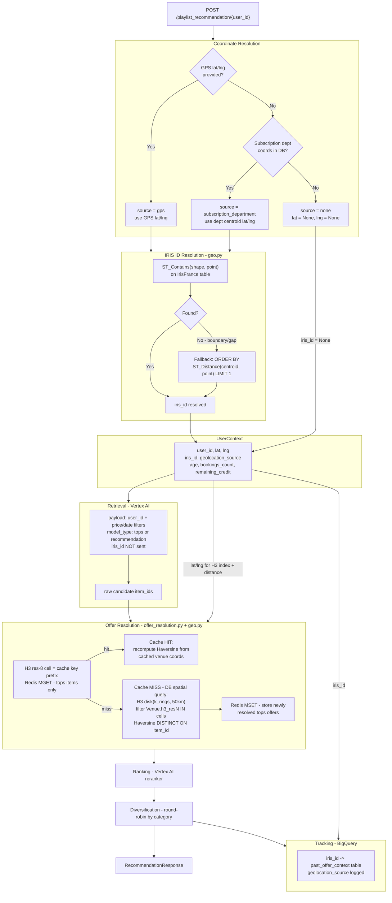

# Geolocalisation Pipeline — `playlist_recommendation`

## Overview

This diagram shows how coordinates, IRIS IDs and H3 indexes flow through the
`/playlist_recommendation/{user_id}` route, from coordinate resolution to the
final response.

**Key roles:**
- **`iris_id`** — resolved once at context-build time, written to BigQuery tracking only. Never used for retrieval or ranking.
- **H3 indexes** — used in two independent places: Redis offer-resolution cache key (res-8) and spatial DB pre-filter on `Venue` (variable resolution, ~50 km disk).

